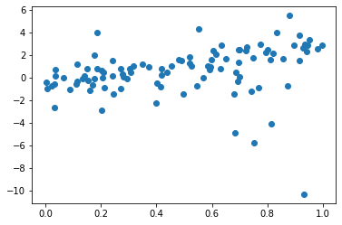

## Outcomes

We're going to be working towards building up **our own neural net model from the ground up**. Here's the outline:

1. Single linear regression **this activity**
2. Multiple linear regression **this week's Fundamentals**
3. Logistic regression **next week**
4. Multiple layers **future Homework**

Today's exercise is about the *process*, not the *product*; only future exercises will have something to turn in.

This activity will improve your ability to:

- Describe the parameters and operation of a linear layer.
  - Implement single linear regression manually and calculate MSE
- Identify the Mean Squared Error loss function.
- Estimate the gradient numerically, by hand and then in code.
  - Explain why the gradient for one parameter may initially seem to go in the wrong direction.
  - Contrast the effects of gradient *ascent* and gradient *descent*.
- Implement a training loop for a simple model.
  - Descend the estimated gradient until convergence.

## Outline

Here's what we'll do today:

1. Load up a simple dataset. (*code provided*)
2. Write some code to compute a linear regression prediction. (*code from a past exercise*)
3. Write some code to compute the mean squared error. (*code from a past exercise*)
4. Use that code to fit a model "by hand" and get a feel for what the "gradient" is.
5. Compute a gradient numerically.
6. Implement a loop to do gradient descent to fit a linear model.

## Setup

Download the [template](lab04.ipynb).

## Task

Suppose we have a dataset with just a single feature `x` and continuous outcome variable `y`.

In general we're going to be faced with a dataset with an unknown and probably nonlinear relationship. But for now let's use a simple dataset with a known linear relationship:
    

(The code to generate this is in your template.)

Let's fit a line to that!

In linear regression, we predict an output by computing `y_pred = x * weights + bias`. (This is the familiar "mx + b" notation, except we flip the x and m for reasons that will become clear when we go to multiple features and `w` has two axes.)

This is a one-dimensional problem (each data point has only a single number, *x*), but the intuition we gain here will help us with multiple linear regression and beyond.

In fact, to keep things simple, we're going to start with all-zero **weights == 0**: we're only going to fit the intercept (`bias`).

We'll use the `Linear` layer that we coded up in Lab 1; a solution to that exercise is included in the provided template.

We'll minimize the Mean Squared Error (MSE) loss. MSE is not the only possible loss for a regression task like this; you might come back and try the Mean *Absolute* Error. But it's by far the most commonly used loss.

{}
1. Run all the code blocks through the code block starting with `@widgets.interact`.
2. Fill in the computations for `resid` (subtract `y_pred` from `y_true`) and `mse` (refer to Lab 1 if you need to).
3. Discuss with your partner **what change should you make to `bias` to reduce the MSE?
4. **Adjust the bias slider until you get a reasonably small MSE.**
5. Discuss with your partner how well this line fits the data.
{}

> Sidebar on implementation details:
>
> 1. The `@` line before a function is a *decorator*. They're really useful Python tricks. We're not studying them in class but I'd be happy to discuss at office hours.
> 2. `widgets.interact()` makes a slider widget and reruns the function when the slider changes. The `(-5.0, 5.0)` sets the *range* of the slider. Don't worry, `bias` is just a normal `float`. When 
> 3. The `f"MSE: {mse}"` is an `f`-string. Expressions in `{}` get evaluated. You can format them too: `f"MSE: {mse:0.3f}"`.

{}

On a piece of paper, manually plot a curve of MSE on the y axis and `bias` on the x axis.

- What value of `bias` minimizes this function? (We'll call this `bias_opt`.)
- Draw the line tangent to the MSE curve at `bias = 0`. Just eyeballing the graph, what is the slope of that line?
- Draw the tangent line at `bias_opt`. What is the slope of that tangent line? (Can you know it exactly?)

{}

### Gradient

As you were tweaking the bias, you were effectively estimating the *gradient* of the loss function with respect to the parameter. The *gradient* tells us which direction (and how much) to change a value like *bias* if we want to *increase* a number like the MSE. Basically, how much does MSE change when we change that parameter?

Soon see how we can compute the gradient exactly using code. But for now, let's estimate that gradient *numerically*. Remember that the derivative of `f(x)` is defined as a zoomed-in "rise over run" -- how much `f(x)` changes when you make small (`eps`ilon-sized) changes to `x`, divided by the size of that change, i.e., `f(x + eps) - f(x)` (the "rise") divided by `eps` (the "run").

(In essence, we're going to wiggle the bias slider automatically. `eps` is how big of a wiggle to make.)

{}

1. Write a function `linreg_mse` that computes the MSE for a given bias. (Start with the function above, add a `return`, and remove the plotting, printing, and `@interact`.) Test that function at a few specific values of `bias`; check that you get the same result as before.
2. Write a function `compute_grad_wrt_bias` that uses numerical difference to compute the gradient of the loss with respect to (`wrt`) the bias parameter. We can compute the gradient using a numerical difference: `(linreg_mse(x0 + eps) - linreg_mse(x0)) / eps`. Set `eps` ("epsilon") to 1e-3 and use two different values of `x0`: 0.0, and the value that you wrote down above that minimizes the MSE.
3. Refer back to the sketch you made of the function. Discuss with your partner how the gradient values you just computed connect with what you observed about that sketch.

{}

### Gradient Descent

Now that we know the gradient, we can use it to change the bias. Let's try **gradient ascent**:

{}

1. In one code chunk, set `bias = 0.0`, `loss` to the result of calling `linreg_mse`, and `gradient = compute_grad_wrt_bias(bias)`. Print these three values. (Suggestion: use `f`-strings to make a nicely formatted output.)
2. In a second code chunk, take a small step in the direction of the gradient: `bias += 0.01 * gradient`.
3. Rerun the first code chunk. How did the loss change? How did the gradient change?

{}

The gradient tells us how much the loss will *increase* as bias increases. But we want the loss to *decrease*. So we actually need to step in the *opposite* direction of the gradient. Hence the name *gradient descent*:

{}

1. Repeat the above task, but instead, take a small step in the *descent direction*, the opposite direction of the gradient: `bias -= 0.01 * gradient`. What effect did that have on the loss?
2. Combine the two code chunks into one. Run it several times and watch what happens to the bias, loss, and gradient.

{}

The constant multiple 0.01 is called the *learning rate*. We'll worry about tuning it later; for now 0.01 is fine.

> You might try setting the learning rate higher. What happens when you set it to a larger value, like near 1.0 or perhaps a bit larger?

### Gradient Descent Loop (*optional*)

What happens if we repeatedly take steps in the descent direction? Let's try it!

{}

- Set `bias` to 0.0 and `losses` to an empty list (`[]`).
- Repeat 100 times:
  - Compute the loss (MSE) and append it to `losses`.
  - Compute the gradient (numerically, as before).
  - Step in the direction opposite the gradient, with a learning rate of 0.01.
- Plot `losses`: `plt.plot(losses)`

{}

## Extension

Try to minimize both `weights` and `bias`. What needs to change?

> When we're evaluating the loss or gradient with respect to the weights, why can't we just set `bias` to 0.0?

## Check for Understanding

You should now be able to answer the following questions:

1. Considering the gradient of the bias parameter with respect to the MSE: if the value of the gradient is *positive*, which direction do we need to move to get a lower MSE?
2. If the value of the gradient is *negative*, which direction do we need to move to get a lower MSE?
3. What can we say about the gradient when the parameter minimizes the MSE?
4. What would we need to change in order to use gradient descent to minimize the MAE (mean *absolute* error) instead?

- Which of the following is 0 at the optimal value: the bias, loss, or gradient?

*In future labs you will turn in these questions. For this lab it's optional.*
