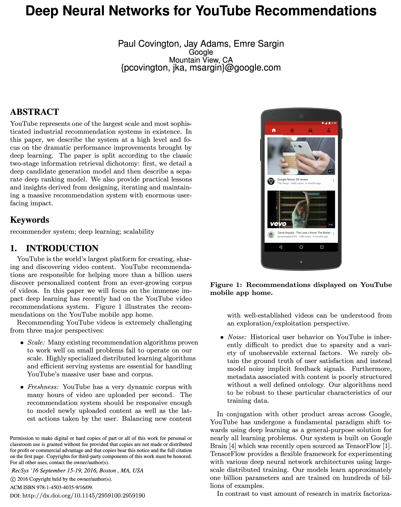

```{r setup, include=FALSE}
knitr::opts_chunk$set(echo = FALSE)
source("../slides-common.R")
slideSetup()
```

## Projects

- Project showcase instead of final exam
- Can be in teams (if each member has a clear role and contribution)
- Should demonstrate:
  - *understanding* of how something in ML works
  - *implementation* and *experimentation* skills
  - *communication* skills

---

## Replication Project

- **Replicate** some prior result
  - "They got a number. Can we get the same number?" (or better?)
  - Pick a single, simple result
  - Write some part of the code yourselves (data input, modeling, optimizer, experiment harness, etc.)
  - Then **extend** in some way.

---

## Mechanistic Interpretatability Project

- Try to understand how a model works
- many examples of open questions

---

## Application Project

- Try to use ML to solve a problem
- I have lots of ideas, but you can also propose your own

---

## Exploration Project

- Try out some variation on a common ML technique
- e.g., lots of variations possible on the Transformers architecture ("what if...")
  - if we included a key with a value that's always zero?
  - if each layer could query the prior layer?
  - if different layers had different numbers of heads?
- Try out different activation functions (stairsteps?)

---

## Best Performance Under Constraints Project

- Limited compute (e.g., our lab computers or your laptop)
- Limited data (small subset?)
- Simplest model (e.g., less than N parameters or bytes)
- Fastest training (e.g., less than N seconds)

---

## Objectives

* What data do recommender systems work with?
* What outputs do recommender systems produce?
* What are the core ideas behind the collaborative filtering approach to recommender systems?
* Identify what *embeddings* are.
* Describe how embeddings address the problem of *high cardinality*.
* Compare and contrast *item embeddings* (in recommender systems) and *word embeddings* (in language modeling).

(We'll practice with sklearn, but won't lecture on it)

---

## Recommender Systems

Think of a few experiences you've had with recommender systems.

- What sort of things were recommended to you?
- What were some signals that you gave to the system that the recommendation was good (or not)?
- What other data did the system have about you?
- What other data did the system have about the items it recommended to you?

---

## Collaborative Filtering

- Goal: predict how much a user will like an item (movie, book, song, etc.)
- "Collaborative": based on what other users have done
- "Filtering": lots of possible items; find the few relevant ones

---

class: center

```{r echo=FALSE, out.width="80%"}

```

---

class: center

```{r echo=FALSE, out.width="80%"}

```
.floating-source[[Deep Neural Networks for YouTube Recommendations](https://research.google.com/pubs/pub45530.html)]

---

## RecSys Data

Imagine the data tables that YouTube might be using. What are the columns? Rows?

---

## RecSys Data

| timestamp | Viewer | Video | Watch time |
|----|---|---|---|---|
| 1616963421 | UC2nEn-yNA1BtdDNWziphPGA | WK_Nr4tUtl8 | 600 |
| 1616963422 | UCYO_jab_esuFRV4b17AJtAw | aircAruvnKk | 1153 |
| ...


- Tabular
- Categorical features with high *cardinality*
  - Lots of viewers!
  - Lots of videos!

---

## Core Idea: Similarity

- Find examples where people like you
- ... watch videos like the ones being considered

So we need a way to measure *similarity* for both *users* and *items*

---

## Live Experimentation

> During development, we make extensive use of offline metrics (precision, recall, ranking loss, etc.) to guide iterative improvements to our system. However for the final determination of the effectiveness of an algorithm or model, **we rely on A/B testing via live experiments**. In a live experiment, we can measure subtle changes in click-through rate, watch time, and many other metrics that measure user engagement. This is important because **live A/B results are not always correlated with offline experiments**.

--

* They don't use likes, surveys, etc., but rather **watches**.
* Why? **Lots more data**! "allowing us to produce recommendations deep in the tail where explicit feedback is extremely sparse."

???

This is a very rich paper in terms of practical applications of machine learning in an organization.
I'll just highlight a few things.

---

class: center

```{r out.width="70%"}
knitr::include_graphics("images/yt-candidate-generation-no-serving.png")
```

---

## Latent Vectors: Genres

- Imagine you know the "genre" of each video.
- "Will user X like video Y?" = how many of the *movie's* genres does the *user* like?

(In practice we don't actually know all of the "genre" features. Soon we'll see how we can learn them.)

---


## Which movies are similar?

Intuition: represent a *movie* by its *genre vector*.


| title       | Star Wars (1977) | Contact (1997) | Fargo (1996) | Return of the Jedi (1983) | Liar Liar (1997) | English Patient, The (1996) | Scream (1996) | Toy Story (1995) | Air Force One (1997) | Independence Day (ID4) (1996) |
|------------|-----------------|---------------|-------------|--------------------------|-----------------|----------------------------|--------------|-----------------|---------------------|------------------------------|
| Action      | 1                | 0              | 0            | 1                         | 0                | 0                           | 0             | 0                | 1                    | 1                             |
| Adventure   | 1                | 0              | 0            | 1                         | 0                | 0                           | 0             | 0                | 0                    | 0                             |
| Animation   | 0                | 0              | 0            | 0                         | 0                | 0                           | 0             | 1                | 0                    | 0                             |
| Children's  | 0                | 0              | 0            | 0                         | 0                | 0                           | 0             | 1                | 0                    | 0                             |
| Comedy      | 0                | 0              | 0            | 0                         | 1                | 0                           | 0             | 1                | 0                    | 0                             |
| Crime       | 0                | 0              | 1            | 0                         | 0                | 0                           | 0             | 0                | 0                    | 0                             |
| Documentary | 0                | 0              | 0            | 0                         | 0                | 0                           | 0             | 0                | 0                    | 0                             |
| Drama       | 0                | 1              | 1            | 0                         | 0                | 1                           | 0             | 0                | 0                    | 0                             |
| Fantasy     | 0                | 0              | 0            | 0                         | 0                | 0                           | 0             | 0                | 0                    | 0                             |
| Film-Noir   | 0                | 0              | 0            | 0                         | 0                | 0                           | 0             | 0                | 0                    | 0                             |
| Horror      | 0                | 0              | 0            | 0                         | 0                | 0                           | 1             | 0                | 0                    | 0                             |
| Musical     | 0                | 0              | 0            | 0                         | 0                | 0                           | 0             | 0                | 0                    | 0                             |
| Mystery     | 0                | 0              | 0            | 0                         | 0                | 0                           | 0             | 0                | 0                    | 0                             |
| Romance     | 1                | 0              | 0            | 1                         | 0                | 1                           | 0             | 0                | 0                    | 0                             |
| Sci-Fi      | 1                | 1              | 0            | 1                         | 0                | 0                           | 0             | 0                | 0                    | 1                             |
| Thriller    | 0                | 0              | 1            | 0                         | 0                | 0                           | 1             | 0                | 1                    | 0                             |
| War         | 1                | 0              | 0            | 1                         | 0                | 1                           | 0             | 0                | 0                    | 1                             |
| Western     | 0                | 0              | 0            | 0                         | 0                | 0                           | 0             | 0                | 0                    | 0                             |


???

```
from fastai.collab import *
from fastai.tabular.all import *
path = untar_data(URLs.ML_100k)
ratings = pd.read_csv(path/'u.data', delimiter='\t', header=None,
                      names=['user','movie','rating','timestamp'])
# Use the full set of column names from `path/"README"`.
column_names = ["movie", "title", "release date", "video release date", "IMDb URL", "unknown", "Action", "Adventure", "Animation", "Children's", "Comedy", "Crime", "Documentary", "Drama", "Fantasy", "Film-Noir", "Horror", "Musical", "Mystery", "Romance", "Sci-Fi", "Thriller", "War", "Western"]
movies = pd.read_csv(path/'u.item',  delimiter='|', encoding='latin-1',
                     names=column_names, header=None)
with_rating_count = movies.merge(ratings.groupby('movie').rating.count().to_frame('num_ratings').reset_index()).sort_values('num_ratings', ascending=False)
print(with_rating_count[['title'] + column_names[6:]].iloc[:10].T.to_markdown())
```

---

## Genre vectors are *embeddings* (but not great ones)

* A *vector* for each *thing*
* Typically *tens* or *hundreds* of numbers
  - fewer numbers than the number of things (so can't be one-hot)
  - a "bottleneck": has to represent everything important about the thing
* Typically *trained* so that *similarity* is meaningful.

---

## How do embeddings measure similarity?

* Two movies are *similar* if their *genre vectors* are "nearby".
* e.g., "Star Wars (A New Hope)" and "Return of the Jedi" share 5 genres with each other
* ... 3 with "Independence Day"
* ... and 0 with "Toy Story"


Can you think of a math operation that would give us the number of genres in common?

* Perhaps from *linear algebra*?

--

* Multiply pairs of numbers. (Each genre shared by two movies gets a 1; otherwise 0.) Then sum.

--

* aka, the **dot product**.

--

* sometimes *normalize by vector magnitude* (giving "cosine similarity")

---

## User Vectors

- We can represent each user by a vector too
- Simple model: rating = dot product of user vector and movie vector
  - Intuition: how much does that user like each genre?
  - e.g., "I like action movies, but not horror movies"
  - More complex models are possible too.

What would *your* user vector look like?


---

## Learn User Vectors by Gradient Descent

- Imagine you know the "genre" of each video.
- Use data to determine which genres each *user* likes.

How might we do that?

---

## Learn Everything by Gradient Descent

- Suppose some videos lack genre information. We could look at *which users liked them*.

--

- But then we'd get better vectors for those users.
- So we could use those to get better vectors for even the movies that we do have genre data for.

--

- Turns out we don't need *any* prior genre information; just initialize randomly and learn from data.

---

## Algorithm to Learn Embeddings from Data

Same as usual:

- Construct a model with vectors for each user and each movie
- Initialize randomly
- For each batch of ratings:
  1. Compute the predictions
  2. Compute the loss
  3. Compute the gradients
  4. Update the parameters

---

class: center, middle

## How do embeddings solve high cardinality?

--

Work with tens of numbers instead of tens of thousands of movies.


---

## Extension: Word Embeddings

Task: given a single word, predict the next word

* "red lentil chili recipe"
* "red lentil curry recipe"
* "chickpea chili recipe"
* "chickpea" \_\_\_

What will you predict? How?

<br>

--

| word | lentil | chickpea | recipe | dish | red | yellow | chili | curry |
|---|---|---|---|
| is an ingredient | 1 | 1 | 0 | 0 | 0 | 0| 0 | 0 |
| is a legume | 1 | 1 | 0 | 0 | 0 | 0| 0 | 0 |
| is a color | 0 | 0 | 0 | 0 | 1 | 1 | 0 | 0 |
| is information  | 0 | 0 | 1 | 0 | 0 | 0 | 0 | 0 |
| described by an ingredient | 0 | 0 | 1 | 1 | 0 | 0 | 1 | 1 |


---

## Where do those embeddings come from?

**Option A**: hire an army of linguists (and food experts etc.)

--

**Option B**: learn it from data.


* "The meaning of a word is its use in the language" - Wittgenstein
* "You know a word by the company it keeps" - [John Firth](https://en.wikipedia.org/wiki/John_Rupert_Firth), 1950's linguist


---

```{r}
knitr::include_graphics("images/slp3-parallelogram.png")
```

.floating-source[Source: Jurafsky and Martin. [Speech and Language Processing 3rd ed](https://web.stanford.edu/~jurafsky/slp3/)]

---

.pull-left[
```{r out.width="100%"}
knitr::include_graphics("images/comparative_superlative.jpg")
```
]

.pull-right[
```{r out.width="100%"}
knitr::include_graphics("images/man_woman.jpg")
```
]

See also:
[Word embeddings quantify 100 years of gender and ethnic stereotypes](https://www.pnas.org/content/115/16/E3635) (Garg et al, PNAS 2018)

.floating-source[Source: [GloVe project](https://nlp.stanford.edu/projects/glove/)]

---

## How does word2vec work?

```{r out.width="100%"}
knitr::include_graphics("images/slp3-skipgram.png")
```


---

## Further Reading

* [Deep Neural Networks for YouTube Recommendations](https://research.google.com/pubs/pub45530.html), Covington et al, RecSys '16.
  * [Video of the presentation](https://www.youtube.com/watch?v=WK_Nr4tUtl8)
  * [Morning Paper summary](https://blog.acolyer.org/2016/09/19/deep-neural-networks-for-youtube-recommendations/)
* [Deep Learning Based Recommender System: A Survey and New Perspectives](https://doi.org/10.1145/3285029)

---

class: center, middle

## Other topics

---

## Weight Decay

Which would need larger weights?

1. One neuron activates for each training example
2. Several different neurons activate for each training example

Weight decay encourages #2

---

## Sigmoid-range

- `sigmoid(x) = softmax([x, 0])` (so it's between 0 and 1)
  - But can't be *exactly* 0 or 1 unless x is huge or tiny
- Can shift and scale to get any range, e.g., `5 * sigmoid(x)`
  - Useful for ratings (1-5)
  - To let it output 5 without extreme values, scale to a bit larger, e.g., `6*sigmoid(x)`

---

## PCA (Principal Component Analysis)

- A simple, unsupervised method to get embeddings from data
- Tries to capture the variance of the data
- If all of the variance is in one direction, then the first principal component will be that direction
- Constraint: can only project onto lines
