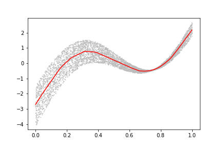

```{r setup, include=FALSE}
knitr::opts_chunk$set(echo = FALSE)
source("../slides-common.R")
slideSetup()
```

## Logistics

* Project update instead of Reflection 7?
* Good Friday? Easter Monday?
  * No homework this weekend (next reading by Wednesday 4/7)
  * On Good Friday should we...
    * current plan: lab (no turn in)
    * alternatives: no class, or in-class lament around AI?
* Next context activity: recommender systems!

---

## Q&A

> Freeze and unfreeze??

"Feature learning" / "representation learning".

Lab 4 example:

.pull-left[
```{r}
knitr::include_graphics("images/lab4-features.png")
```
]

.pull-right[
```{r}

```
]

---

## Q&A Continued

> Can you use regression and classification in the same model?

When ch6 fine-tuned a ResNet for regression, it basically *was*:

* model initially trained on classification task (ImageNet)
* fine-tuned on a regression task (head location)


---

## Recommender Systems

Think of a few experiences you've had with recommender systems.

* What sort of things were recommended to you?
* What were some signals that you gave to the system that the recommendation was good (or not)?
* What other data did the system have about you?
* What other data did the system have about the items it recommended to you?

---

class: center

```{r echo=FALSE, out.width="80%"}
knitr::include_graphics("images/yt-recsys-p1.png")
```
.floating-source[[Deep Neural Networks for YouTube Recommendations](https://research.google.com/pubs/pub45530.html)]
---

## RecSys Data

Draw an example of the *data table*(s) that YouTube might be using. (What are the columns?)

Columns:

.can-edit[
* Person
]

---

## RecSys Data

| timestamp | Viewer | Video | Watch time |
|----|---|---|---|---|
| 1616963421 | UC2nEn-yNA1BtdDNWziphPGA | WK_Nr4tUtl8 | 600 |
| 1616963422 | UCYO_jab_esuFRV4b17AJtAw | aircAruvnKk | 1153 |
| ...


* Tabular
* Categorical features with high *cardinality*
  * Lots of viewers!
  * Lots of videos!

---

## Core Idea: Similarity

* Find examples of people like you
* ... interacting with items like the ones being considered

So we need a way to measure *similarity* for both *users* and *items*

---

## Live Experimentation

> During development, we make extensive use of offline metrics (precision, recall, ranking loss, etc.) to guide iterative improvements to our system. However for the final determination of the effectiveness of an algorithm or model, **we rely on A/B testing via live experiments**. In a live experiment, we can measure subtle changes in click-through rate, watch time, and many other metrics that measure user engagement. This is important because **live A/B results are not always correlated with offline experiments**.

--

* They don't use likes, surveys, etc., but rather **watches**.
* Why? **Lots more data**! "allowing us to produce recommendations deep in the tail where explicit feedback is extremely sparse."

???

This is a very rich paper in terms of practical applications of machine learning in an organization.
I'll just highlight a few things.

---

class: center

```{r out.width="70%"}
knitr::include_graphics("images/yt-candidate-generation-no-serving.png")
```

---

## Learn by Gradient Descent

* Imagine you know the "genre" of each video.
* Use data to determine which genres each user likes.

--

* But some videos lack genre information. So look at *which users liked them*

--

* Turns out we don't need *any* prior genre information; just initialize randomly.

---

## Exercise

On paper (or electronically), briefly explain collaborative filtering.

--

Share your explanation with a partner.
