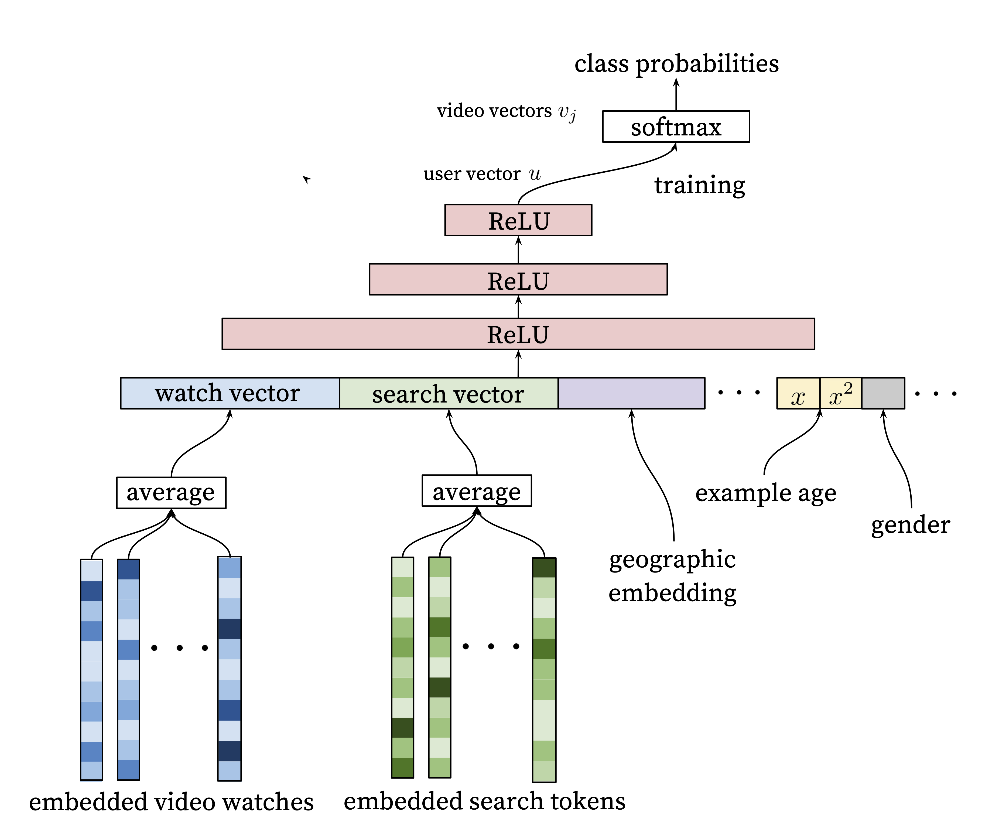
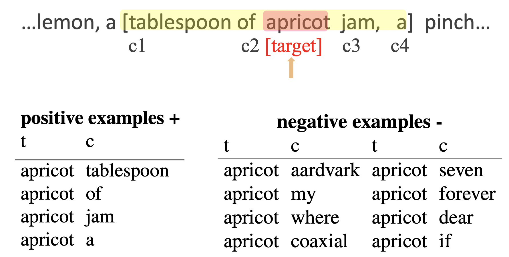

```{r setup, include=FALSE}
knitr::opts_chunk$set(echo = FALSE)
source("../slides-common.R")
slideSetup()
```

## Objectives

.pull-left[
Review:

* What data do recommender systems work with?
* What outputs do recommender systems produce?
* What are the core ideas behind the collaborative filtering approach to recommender systems?
]

.pull-right[
Today:

* Identify what *embeddings* are.
* Describe how embeddings address the problem of *high cardinality*.
* Compare and contrast *item embeddings* (in recommender systems) and *word embeddings* (in language modeling).
]

Write answers to the three questions on the left.

--

Share your answers with a partner.


---

class: center

```{r out.width="70%"}

```

---

## Which movies are similar?

Intuition: represent a *movie* by its *genre vector*.


| title       | Star Wars (1977) | Contact (1997) | Fargo (1996) | Return of the Jedi (1983) | Liar Liar (1997) | English Patient, The (1996) | Scream (1996) | Toy Story (1995) | Air Force One (1997) | Independence Day (ID4) (1996) |
|------------|-----------------|---------------|-------------|--------------------------|-----------------|----------------------------|--------------|-----------------|---------------------|------------------------------|
| Action      | 1                | 0              | 0            | 1                         | 0                | 0                           | 0             | 0                | 1                    | 1                             |
| Adventure   | 1                | 0              | 0            | 1                         | 0                | 0                           | 0             | 0                | 0                    | 0                             |
| Animation   | 0                | 0              | 0            | 0                         | 0                | 0                           | 0             | 1                | 0                    | 0                             |
| Children's  | 0                | 0              | 0            | 0                         | 0                | 0                           | 0             | 1                | 0                    | 0                             |
| Comedy      | 0                | 0              | 0            | 0                         | 1                | 0                           | 0             | 1                | 0                    | 0                             |
| Crime       | 0                | 0              | 1            | 0                         | 0                | 0                           | 0             | 0                | 0                    | 0                             |
| Documentary | 0                | 0              | 0            | 0                         | 0                | 0                           | 0             | 0                | 0                    | 0                             |
| Drama       | 0                | 1              | 1            | 0                         | 0                | 1                           | 0             | 0                | 0                    | 0                             |
| Fantasy     | 0                | 0              | 0            | 0                         | 0                | 0                           | 0             | 0                | 0                    | 0                             |
| Film-Noir   | 0                | 0              | 0            | 0                         | 0                | 0                           | 0             | 0                | 0                    | 0                             |
| Horror      | 0                | 0              | 0            | 0                         | 0                | 0                           | 1             | 0                | 0                    | 0                             |
| Musical     | 0                | 0              | 0            | 0                         | 0                | 0                           | 0             | 0                | 0                    | 0                             |
| Mystery     | 0                | 0              | 0            | 0                         | 0                | 0                           | 0             | 0                | 0                    | 0                             |
| Romance     | 1                | 0              | 0            | 1                         | 0                | 1                           | 0             | 0                | 0                    | 0                             |
| Sci-Fi      | 1                | 1              | 0            | 1                         | 0                | 0                           | 0             | 0                | 0                    | 1                             |
| Thriller    | 0                | 0              | 1            | 0                         | 0                | 0                           | 1             | 0                | 1                    | 0                             |
| War         | 1                | 0              | 0            | 1                         | 0                | 1                           | 0             | 0                | 0                    | 1                             |
| Western     | 0                | 0              | 0            | 0                         | 0                | 0                           | 0             | 0                | 0                    | 0                             |


???

```
from fastai.collab import *
from fastai.tabular.all import *
path = untar_data(URLs.ML_100k)
ratings = pd.read_csv(path/'u.data', delimiter='\t', header=None,
                      names=['user','movie','rating','timestamp'])
# Use the full set of column names from `path/"README"`.
column_names = ["movie", "title", "release date", "video release date", "IMDb URL", "unknown", "Action", "Adventure", "Animation", "Children's", "Comedy", "Crime", "Documentary", "Drama", "Fantasy", "Film-Noir", "Horror", "Musical", "Mystery", "Romance", "Sci-Fi", "Thriller", "War", "Western"]
movies = pd.read_csv(path/'u.item',  delimiter='|', encoding='latin-1',
                     names=column_names, header=None)
with_rating_count = movies.merge(ratings.groupby('movie').rating.count().to_frame('num_ratings').reset_index()).sort_values('num_ratings', ascending=False)
print(with_rating_count[['title'] + column_names[6:]].iloc[:10].T.to_markdown())
```

---

## Genre vectors are *embeddings* (but not great ones)

* A *vector* for each *thing*
* Typically *tens* or *hundreds* of numbers
* Typically *trained* so that *similarity* is meaningful.

---

## How do embeddings measure similarity?

* Two movies are *similar* if their *genre vectors* are "nearby".
* e.g., "Star Wars (A New Hope)" and "Return of the Jedi" share 5 genres with each other
* ... 3 with "Independence Day"
* ... and 0 with "Toy Story"


Can you think of a math operation that would give us the number of genres in common?

* Perhaps from *linear algebra*?

--

* Multiply pairs of numbers. (Each genre shared by two movies gets a 1; otherwise 0.) Then sum.

--

* aka, the **dot product**.

--

* sometimes *normalize by vector magnitude* (giving "cosine similarity")

---

## Learn by Gradient Descent

* Imagine you know the "genre" of each video.
* Use data to determine which genres each user likes.

--

* But some videos lack genre information. So look at *which users liked them*

--

* Turns out we don't need *any* prior genre information; just initialize randomly.

---

class: center, middle

## How do embeddings solve high cardinality?

--

Work with tens of numbers instead of tens of thousands of movies.


---

## Extension: Word Embeddings

Task: given a single word, predict the next word

* "red lentil chili recipe"
* "red lentil curry recipe"
* "chickpea chili recipe"
* "chickpea" \_\_\_

What will you predict? How?

<br>

--

| word | lentil | chickpea | recipe | dish | red | yellow | chili | curry |
|---|---|---|---|
| is an ingredient | 1 | 1 | 0 | 0 | 0 | 0| 0 | 0 |
| is a legume | 1 | 1 | 0 | 0 | 0 | 0| 0 | 0 |
| is a color | 0 | 0 | 0 | 0 | 1 | 1 | 0 | 0 |
| is information  | 0 | 0 | 1 | 0 | 0 | 0 | 0 | 0 |
| described by an ingredient | 0 | 0 | 1 | 1 | 0 | 0 | 1 | 1 |


---

## Where do those embeddings come from?

**Option A**: hire an army of linguists (and food experts etc.)

--

**Option B**: learn it from data.


* "The meaning of a word is its use in the language" - Wittgenstein
* "You know a word by the company it keeps" - [John Firth](https://en.wikipedia.org/wiki/John_Rupert_Firth), 1950's linguist


---

```{r}
knitr::include_graphics("images/slp3-parallelogram.png")
```

.floating-source[Source: Jurafsky and Martin. [Speech and Language Processing 3rd ed](https://web.stanford.edu/~jurafsky/slp3/)]

---

.pull-left[
```{r out.width="100%"}
knitr::include_graphics("images/comparative_superlative.jpg")
```
]

.pull-right[
```{r out.width="100%"}
knitr::include_graphics("images/man_woman.jpg")
```
]

See also:
[Word embeddings quantify 100 years of gender and ethnic stereotypes](https://www.pnas.org/content/115/16/E3635) (Garg et al, PNAS 2018)

.floating-source[Source: [GloVe project](https://nlp.stanford.edu/projects/glove/)]

---

## How does word2vec work?

```{r out.width="100%"}

```


---

## Further Reading

* [Deep Neural Networks for YouTube Recommendations](https://research.google.com/pubs/pub45530.html), Covington et al, RecSys ’16.
  * [Video of the presentation](https://www.youtube.com/watch?v=WK_Nr4tUtl8)
  * [Morning Paper summary](https://blog.acolyer.org/2016/09/19/deep-neural-networks-for-youtube-recommendations/)
* [Deep Learning Based Recommender System: A Survey and New Perspectives](https://doi.org/10.1145/3285029)


---

## Objectives

.pull-left[
Review:

* What data do recommender systems work with?
* What outputs do recommender systems produce?
* What are the core ideas behind the collaborative filtering approach to recommender systems?
]

.pull-right[
Today:

* Identify what *embeddings* are.
* Describe how embeddings address the problem of *high cardinality*.
* Compare and contrast *item embeddings* (in recommender systems) and *word embeddings* (in language modeling).
]

---

## Wrap-up

1. Write down 3 key things you learned today.

2. What questions do you have about what we discussed today?

Submit [this form](https://forms.office.com/r/KvJRKxfuVp).

```{r echo=FALSE, out.width="25%", fig.align='center'}
library(qrcode)
qrcode::qrcode_gen('https://forms.office.com/r/KvJRKxfuVp')

```

